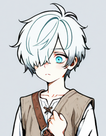

# Heads, Tails, or Justice? / 掷问天意


> A multilingual interactive moral-decision visual novel and behavioral-data collection framework.
>
> 一款结合视觉小说叙事、道德困境决策与行为数据记录的多语言实验工具原型。

<div align="center">
  
</div>

## Overview

**Heads, Tails, or Justice? (HToJ)** is a solo-developed Unity project exploring how people make choices under moral uncertainty.

The current **Tool Build** is a packaged vertical slice designed for internal demonstration, pilot testing and future experimental adaptation. It combines:

- branching narrative written in **Ink**;
- Unity-based dialogue, portraits and investigation interactions;
- profile-isolated save data and telemetry sessions;
- multilingual presentation in English, Simplified Chinese, Japanese and Korean.

This repository also supports a separate long-form story direction. The experimental/tool build and the full narrative work are intentionally kept as distinct development tracks.

## Current Playable Flow

```text
MainMenu
   ↓
Prologue
   ↓
Chapter0_Test — Trolley dilemma
   ↓
Chapter1_Test — Heinz dilemma
   ↓
Chapter2_Test — Robin Hood dilemma
   ↓
Test_ending
   ↓
MainMenu
```

Each dilemma includes inspectable scene elements, direct moral choices and an optional coin-based procedure. The coin does not remove responsibility: accepting, rejecting or delegating to it is itself recorded as part of the decision process.

## Tool Build Features

### Narrative and interaction

- Ink-driven dialogue, choices and scene transitions.
- Centralized Ink command routing for speakers, scenes, portraits, audio, props and telemetry actions.
- Speaker-driven portrait switching.
- Typewriter presentation with configurable text speed.
- Investigation objects only become interactive while matching `#id:` choices are active.
- Hover and click behavior is disabled during ordinary narration and typewriter animation.

### Participant profiles and persistence

- Multiple subject profiles.
- Save slots isolated by subject.
- Profile-specific language settings.
- Session-specific telemetry files.
- Anonymous installation identifier instead of a physical-device identifier.
- Save schema and game-version metadata.
- Temporary-file writes for safer save replacement.

### Localization

The playable vertical slice supports:

| Code | Language |
|---|---|
| `EN` | English |
| `ZH_CN` | Simplified Chinese |
| `JP` | Japanese |
| `KR` | Korean |

Localized content includes:

- Prologue, all three dilemma chapters and the test ending;
- main menu, settings and save/load labels;
- calibration and multilingual-profile interfaces;
- localized speaker display names;
- CJK TextMeshPro font assets with dynamic multi-atlas support.

Machine-facing Ink tags remain in English across every language version:

```ink
#speaker: The Judge
#id:SilverCoin
#action: upload_data
#load_scene: Chapter0_Test
#bgm: Dilemma
```

`LocalizedInkTagValidator` checks these tags before building and reports the exact file and line if a localized machine tag is unsafe.

### Behavioral data pipeline

The tool is structured to record subject-separated session and interaction data for later analysis. Current data handling includes:

- subject/profile metadata;
- session identifiers and timestamps;
- narrative and interaction events;
- decision outcomes and supported meta flags;
- explicit upload actions.

Before formal participant deployment, consent wording, privacy documentation, server configuration and study-specific ethics requirements should be reviewed independently.

## Architecture

```text
Ink source files
      │
      ▼
DialogueController ── InkCommandRouter
      │                     │
      ├── dialogue/UI       ├── speaker & portrait commands
      ├── choices           ├── scene and audio commands
      └── investigation     └── telemetry/meta commands
      │
      ▼
GameSystem / SubjectProfileService / TelemetryManager
      │
      ├── profile-isolated saves
      └── per-session behavioral records
```

## Showcase

### Main menu


### Settings


### Save and load


### Current protagonist portrait asset

<div align="center">
  
</div>

## Opening the Project

### Requirements

- Unity `6000.0.62f1`
- Ink Unity Integration included by the project
- Windows is the currently prepared standalone build target

### Run in the Editor

1. Clone or download the repository.
2. Open the project using Unity `6000.0.62f1`.
3. Allow Unity and Ink to finish importing and compiling assets.
4. Open `Assets/Scenes/MainMenu.unity`.
5. Enter Play Mode.

### Localization validation

Before creating a release build, run:

```text
Tools > HToJ > Validate Localized Ink Tags
```

Expected Console result:

```text
[Localization] All localized Ink machine tags are ASCII-safe.
```

### Build

Use the prepared Windows build profile and confirm that the following scenes are enabled:

```text
MainMenu
Prologue
Chapter0_Test
Chapter1_Test
Chapter2_Test
Test_ending
```

The packaged tool product name is `HToJ_Tool`, version `0.1.0`.

## Project Structure

```text
Assets/
├── Editor/
│   └── LocalizedInkTagValidator.cs
├── Main/
│   ├── Art/
│   │   ├── Characters/
│   │   ├── Fonts/
│   │   └── Pic/
│   └── Scripts/
│       ├── Gameplay/
│       ├── Localization/
│       └── MainmenuUI/
├── Resources/
│   └── Story/               # ZH / JP / KR Ink and compiled JSON
├── Scenes/
└── Story/                   # English Ink source and compiled JSON
```

## Development Status

The current tool build has been successfully packaged locally. Its feature set is now considered **frozen**: future changes to this track should focus on confirmed bugs, deployment requirements and study-specific adaptations.

The long-form story version of **掷问天意** remains a separate creative track, with a broader cast, seven shared moral-deliberation chapters and a stronger emphasis on the work's philosophical narrative.

## Author

**Xinbo Gao / Gossip4213**

MScR Neuroscience student at the University of Edinburgh.

Interests include computational neuroscience, neural dynamics, decision-making, moral cognition and multilingual cognition.
